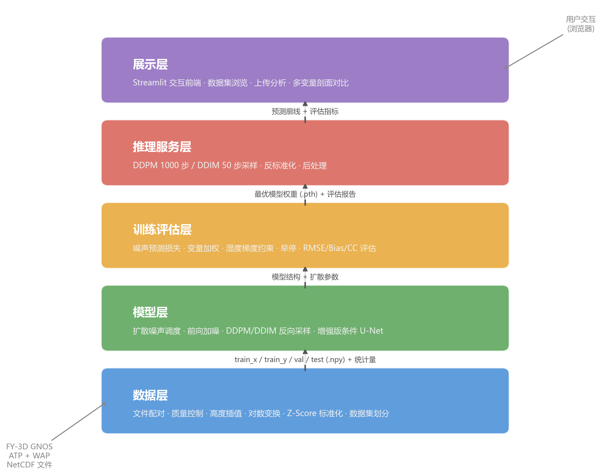

# 基于掩星数据的气象要素反演系统设计与实现

学生：林逸飞（220110814）

专业：计算机科学与技术

说明：本文档为毕业论文初稿，依据 `docs/thesis/outline.md`、项目技术文档和当前实验结果整理而成。文中图表编号、参考文献格式和部分外部文献条目信息后续需按学校模板统一核对。

---

# 摘要

全球导航卫星系统无线电掩星（GNSS-RO）通过接收穿越大气层的导航卫星信号获取大气廓线，具有垂直分辨率高、全天候观测等特点，已被用于数值天气预报和气候监测等任务。传统反演流程通常依次经过 Abel 逆变换、静力平衡积分和一维变分同化等步骤，将弯曲角观测转换为折射率、温度、气压和湿度。该流程物理含义清楚，但容易受到球对称假设、误差逐级传递和低层温湿耦合等因素影响，尤其在对流层湿度反演中仍存在较大不确定性。

针对上述问题，本文设计并实现了一套基于条件扩散模型的 GNSS-RO 气象要素端到端反演系统。系统以 FY-3D GNOS L2 ATP 弯曲角廓线为条件输入，以 WAP 湿大气产品中的温度、气压和湿度廓线为监督标签，利用 2025 年 1 月至 6 月数据构建 ATP+WAP 配对数据集，共得到 64,116 条有效样本。模型部分采用去噪扩散概率模型（DDPM）作为生成框架，以增强版一维条件 U-Net 预测噪声，并通过正弦时间嵌入和交叉注意力机制引入弯曲角条件。训练阶段加入变量加权损失和湿度梯度约束，以减轻三变量联合学习中湿度通道学习不足的问题。

在 9,618 个测试样本上，温度、气压和湿度的相关系数分别为 0.7820、0.9990 和 0.6960，标准化空间 RMSE 分别为 0.6267、0.0756 和 0.7996。与旧基线相比，湿度相关系数由 0.5321 提升至 0.6960，湿度 RMSE 由 0.8690 降低至 0.7996，说明扩大数据规模并调整湿度通道训练权重后，模型对湿度廓线的拟合有所改善。系统还基于 Streamlit 实现了交互式可视化功能，支持数据集浏览、外部数据上传和多变量剖面对比。

关键词：GNSS 无线电掩星；大气剖面反演；条件扩散模型；一维 U-Net；FY-3D GNOS；湿度反演

---

# Abstract

Global Navigation Satellite System Radio Occultation (GNSS-RO) derives atmospheric profiles with high vertical resolution and all-weather availability by receiving navigation satellite signals that traverse the Earth's atmosphere, making it a valuable data source for numerical weather prediction and climate monitoring. Conventional retrieval pipelines convert bending angle observations into refractivity, temperature, pressure and humidity through Abel inversion, hydrostatic integration and one-dimensional variational assimilation. While physically well-founded, these multi-step procedures are subject to spherical symmetry assumptions, cascading error propagation and dry-wet coupling ambiguity, particularly for humidity retrieval in the lower troposphere.

This thesis designs and implements an end-to-end GNSS-RO meteorological profile retrieval system based on a conditional diffusion model. Bending angle profiles from FY-3D GNOS L2 ATP products serve as conditional inputs, while temperature, pressure and humidity profiles from WAP wet atmosphere products provide supervised labels. A paired ATP+WAP dataset of 64,116 valid samples is constructed from January–June 2025 data through file matching, quality control, height-grid interpolation, nonlinear transformation and standardization. The model adopts a denoising diffusion probabilistic model (DDPM) as its generative framework and an enhanced one-dimensional conditional U-Net as the noise prediction network, injecting bending angle conditions via sinusoidal time embedding and cross-attention. Variable-weighted loss and humidity gradient regularization are introduced to address the imbalanced learning difficulty among the three output channels.

On 9,618 test samples, the model achieves correlation coefficients of 0.7820, 0.9990 and 0.6960 for temperature, pressure and humidity, respectively, with normalized RMSE values of 0.6267, 0.0756 and 0.7996. Compared with the previous baseline, the humidity correlation coefficient increases from 0.5321 to 0.6960, while the humidity RMSE decreases from 0.8690 to 0.7996, confirming the effectiveness of dataset expansion and humidity-aware training. A Streamlit-based interactive system supporting dataset browsing, external data upload and multi-variable profile comparison is also developed, providing a complete prototype for intelligent GNSS-RO retrieval.

Keywords: GNSS radio occultation; atmospheric profile retrieval; conditional diffusion model; one-dimensional U-Net; FY-3D GNOS; humidity retrieval

---

# 第1章 绪论

## 1.1 研究背景与意义

大气温度、气压和湿度垂直廓线反映了大气热力结构和水汽分布，是数值天气预报初始场构建、极端天气监测、气候分析和卫星产品验证中常用的基础变量。传统大气探测主要依赖探空、飞机观测、地基雷达、微波辐射计以及多源卫星遥感等手段。探空气球能够提供较高垂直分辨率的原位观测，但站点分布有限，海洋、极地和高原等区域资料相对稀疏；被动卫星遥感水平覆盖较好，但容易受到云雨、地表发射率和反演先验假设影响，垂直分辨率通常有限。因此，如何获取覆盖范围更广、垂直结构更清晰的大气廓线，仍是大气探测中的一个基础问题[1]。

GNSS 无线电掩星技术利用低轨卫星接收 GNSS 卫星发射的无线电信号。当信号穿越地球大气并到达低轨卫星接收机时，受大气折射率垂直变化影响，传播路径会发生弯曲，相位、频率和幅度也随之变化。结合精密轨道和相位观测，可以反推出弯曲角廓线，并进一步获得折射率以及温度、气压、水汽等变量。与传统观测方式相比，GNSS-RO 资料覆盖范围更广，能够补充海洋和偏远地区资料；相位观测长期稳定，受仪器漂移影响较小；同时，无线电信号能够穿透云层，适合获取对流层顶和平流层等高度区域的垂直结构信息[1]。

不过，从 GNSS-RO 原始观测到气象要素产品并不是一步完成的。传统反演通常要经过相位到多普勒频移、多普勒频移到弯曲角、弯曲角到折射率、折射率到温度和气压等步骤，低层湿大气反演还需要结合背景场信息。这个链条中每一步都可能引入误差，且依赖一定的物理假设。例如，Abel 逆变换通常基于局地球对称假设，强水平梯度条件下容易出现结构性误差；低对流层中折射率同时受干空气密度和水汽影响，仅依赖弯曲角难以唯一确定温度与湿度；一维变分方法还会受到背景场和误差协方差设置的影响[2]。基于这些限制，本文尝试从弯曲角廓线出发，直接学习其与温度、气压和湿度廓线之间的非线性关系。

近年来，深度学习方法开始进入遥感反演、气象预测和科学数据建模等任务，Transformer 等模型能够从数据中学习非线性特征表示，对传统物理反演形成补充[3]。在 GNSS-RO 相关研究中，机器学习已被用于海洋大气边界层湿度廓线检索[4]。也有研究将机器学习和贝叶斯插值用于 GNSS-RO 气候产品构建[5]。扩散模型通过逐步加噪和反向去噪建模数据分布，也可以在给定条件下生成目标变量[6]。用于 GNSS-RO 大气剖面反演时，弯曲角廓线可作为条件输入，温度、气压和湿度廓线作为生成目标，模型学习的是从观测空间到大气状态空间的映射关系。这一框架保留了端到端反演的形式，也为后续不确定性估计、多次采样和多源条件融合留下了接口。

基于上述背景，本文围绕“基于掩星数据的气象要素反演系统设计与实现”开展研究，尝试将条件扩散模型用于 FY-3D GNOS 掩星数据的温度、气压和湿度联合反演。

## 1.2 国内外研究现状

GNSS-RO 技术自二十世纪末逐步应用于大气探测以来，已经形成较为成熟的传统反演体系[1]。早期研究主要围绕 GPS/MET、CHAMP、COSMIC 等任务开展，证明了掩星观测在温度廓线反演和数值天气预报同化中的价值。传统 GNSS-RO 反演方法通常以几何光学或波动光学处理为基础，通过相位观测恢复弯曲角，再利用 Abel 逆变换获得折射率廓线。在较高高度层，大气水汽含量较低，可在静力平衡假设下反演干温度和气压；在低对流层，水汽影响显著，通常需要引入背景场，通过一维变分方法同时估计温度、气压和湿度[2]。该类方法具有清晰的物理解释，是目前业务化产品的重要基础。

随着机器学习和深度学习的发展，越来越多研究开始尝试使用数据驱动方法改进大气反演。对于高维观测与目标变量之间的非线性映射，深度神经网络提供了新的建模手段。在 GNSS-RO 领域，近期公开工作已开始尝试将机器学习用于湿度检索和相关气候产品构建[4]。这类方法可以减少传统流程中的部分中间误差传播，但也面临训练数据质量、物理约束不足和泛化能力等问题。

生成式模型的发展也影响了大气反演研究。Ho 等人于 2020 年提出去噪扩散概率模型（DDPM），通过前向加噪和反向去噪学习数据分布[6]。Song 等人随后提出去噪扩散隐式模型（DDIM），通过非马尔可夫采样减少推理步数[7]。Nichol 和 Dhariwal 在 Improved DDPM 中引入可学习方差和余弦噪声调度[8]。Dhariwal 和 Nichol 又通过分类器引导（classifier guidance）进一步提高图像生成质量[9]。条件扩散模型则将类别标签、文本描述或观测数据等外部信息注入去噪过程，使模型可以在给定条件下生成目标结果。常见条件注入方式包括拼接、自适应归一化和交叉注意力等，其中交叉注意力已经在潜扩散模型（LDM）等工作中得到广泛使用[10]。

在生成建模和条件生成任务中，扩散模型已经表现出较强的分布刻画能力，并可在给定条件下生成目标结果[6]。大气廓线是一维连续物理场，存在垂直结构和变量耦合关系。将弯曲角观测作为条件、气象要素廓线作为生成目标，在任务形式上与条件扩散模型较为一致。不过，从现有公开工作看，相关研究更多集中于传统 1DVar 检索、湿度检索或统计/机器学习映射，条件扩散模型在 GNSS-RO 多变量大气廓线反演中的应用仍较少见[4]。

传统 GNSS-RO 反演方法已经较为成熟，但端到端智能反演仍在探索阶段。确定性深度学习模型可以处理非线性映射，却不容易表达反演不确定性；条件扩散模型具有生成式建模和条件注入能力，适合作为一种补充方案。基于此，本文将条件扩散模型引入 FY-3D GNOS ATP+WAP 数据反演任务，并围绕数据处理、模型设计、训练策略和系统实现开展实验。

## 1.3 问题的总结和分析

结合前述研究现状和本文数据条件，GNSS-RO 三变量端到端反演主要面临几方面相互关联的挑战。首先，训练数据构建难度较高。GNSS-RO 反演任务要求输入弯曲角和输出气象要素对应同一掩星事件，也要求样本在高度网格、质量控制和物理范围上保持一致。FY-3D GNOS ATP 与 WAP 产品虽然分别提供了弯曲角和温压湿廓线，但原始文件在命名、质量标志、缺测情况和高度坐标上并不天然统一，必须经过配对、筛选、插值和标准化后才能形成训练样本，因此训练数据集的规模、质量和覆盖范围本身就是课题需要优先解决的问题。

与此同时，弯曲角到温度、气压和湿度之间的映射关系具有明显的非线性特征。传统方法通常通过折射率、静力积分和背景场同化等步骤逐级求解，端到端模型则需要直接学习从观测空间到状态空间的映射。这一映射会受到层结结构、低层水汽、垂直耦合关系以及样本分布差异影响，简单的确定性回归模型难以充分表达。此外，多变量联合训练还存在明显的不平衡现象。在温度、气压和湿度三个通道中，气压廓线整体更平滑、统计规律更稳定，而湿度主要集中在低对流层，变化剧烈且与温度和气压存在更强耦合，学习难度更高。如果直接采用等权训练目标，模型容易优先优化气压等相对容易的通道，导致湿度反演效果不足。除了建模与训练本身，反演系统还要兼顾推理效率与结果解释。扩散模型依赖逐步去噪，推理开销高于普通回归网络；论文评价中也需要区分标准化空间指标和物理空间指标，避免把二者混用。因此，本课题除了训练模型，还需要同步处理采样策略、评估口径和可视化展示等问题。

## 1.4 主要研究内容

围绕上述问题，本文的研究工作主要沿着数据构建、模型设计、训练优化和系统实现四条主线展开。首先，以 FY-3D GNOS L2 ATP 弯曲角产品为输入、以 WAP 温度、气压和湿度廓线产品为监督标签，完成了文件级配对、质量控制、统一高度网格插值、对数变换和标准化处理，构建出覆盖 2025 年 1 月至 6 月、包含 64,116 条有效样本的三变量训练数据集。在此基础上，本文设计了面向 GNSS-RO 廓线反演的条件扩散模型，采用 DDPM 作为生成式反演框架，并以增强版一维条件 U-Net 作为噪声预测网络，通过时间嵌入、残差卷积块和交叉注意力机制，将弯曲角条件注入多尺度去噪过程，实现温度、气压和湿度三变量联合生成。

考虑到湿度通道学习更为困难，本文进一步提出了面向湿度通道的联合训练优化策略，在基础噪声预测损失上引入变量加权机制，将温度、气压和湿度权重设置为 1:1:4，并加入湿度梯度约束，以改善湿度廓线的连续性。同时，以湿度分量验证损失作为模型监控目标，使训练过程更关注湿度反演效果。最终，本文完成了从数据处理、模型训练到 DDPM/DDIM 推理、评估报告生成和 Streamlit 交互式展示前端的原型系统实现，并基于全测试集结果、旧基线对比和消融实验，分析数据规模、损失设计和采样方法对反演性能的影响。

## 1.5 论文组织结构

本文共分为六章。第1章为绪论，介绍研究背景与意义、国内外研究现状、问题的总结和分析、主要研究内容以及全文组织结构。第2章阐述 GNSS 无线电掩星基本原理、传统反演流程、去噪扩散概率模型和一维条件 U-Net 相关技术。第3章介绍数据来源（FY-3D GNOS 卫星、ATP 与 WAP 产品格式），并从需求分析、总体架构、数据处理流水线、模型设计和评估体系等方面给出系统总体设计。第4章介绍系统各模块的具体实现，包括数据处理、模型训练、推理采样和可视化前端。第5章给出实验设置、主实验结果、数据规模影响分析、采样方法对比、损失函数消融实验和结果讨论。第6章总结全文工作，归纳创新点与不足，并展望后续改进方向。

---

# 第2章 相关理论与技术基础

## 2.1 GNSS 无线电掩星原理

GNSS 无线电掩星是一种利用 GNSS 卫星与低轨卫星之间的相对运动进行大气探测的方法。当 GNSS 卫星从低轨卫星视线方向上升起或落下时，其发射的 L 波段无线电信号会掠过地球大气边缘。由于大气折射率随高度变化，信号传播路径不再是直线，而会发生弯曲并产生相位延迟。低轨卫星接收机记录信号的相位和幅度变化，结合卫星精密轨道信息，可以恢复信号传播路径上的弯曲角廓线[11]。

在理想球对称大气假设下，弯曲角与折射率之间存在积分关系。通常以冲击参数表示射线距离地心的最近距离，用弯曲角描述信号传播方向相对于直线传播的偏转程度。通过 Abel 逆变换，可以由弯曲角廓线反演得到折射率廓线。大气折射率与温度、气压和水汽压之间存在经验关系，常用形式为[11]：

$$
N = 77.6 \frac{P}{T} + 3.73 \times 10^5 \frac{e}{T^2} \tag{2-1}
$$

式中：$N$———大气折射率（无量纲）；$P$———气压（hPa）；$T$———温度（K）；$e$———水汽压（hPa）。第一项通常称为干项，主要由干空气密度决定；第二项为湿项，与水汽含量密切相关。中高层大气水汽较少时，湿项可以忽略，反演相对稳定；低对流层水汽含量较高时，温度和湿度对折射率的贡献相互耦合，导致仅凭折射率难以唯一确定温湿结构[2]。

传统 GNSS-RO 产品生产通常先由原始相位观测解算弯曲角，再基于 Abel 逆变换获得折射率，最后在干大气假设或辅助背景场约束下反演温度、气压和湿度。该流程有明确的物理基础，但多步骤处理会带来误差累积。球对称假设在强水平梯度、复杂天气系统和低层水汽丰富区域也可能不完全成立[2]。本文尝试以弯曲角为条件输入，利用数据驱动模型直接学习其与目标气象要素之间的映射关系。

（图 2-x 建议：GNSS 无线电掩星观测原理图，标注 GNSS 卫星、LEO 卫星、切点、弯曲射线路径、弯曲角和冲击参数；如篇幅允许，可补一张传统“弯曲角 - 折射率 - 温压湿”反演链路示意图。）

## 2.2 去噪扩散概率模型

去噪扩散概率模型是一类基于马尔可夫链的生成模型，其核心思想是先将真实数据逐步加入高斯噪声，使其最终接近标准正态分布；再训练神经网络学习反向去噪过程，从随机噪声中逐步恢复数据样本[6]。

设真实大气廓线为 $x_0$，前向扩散过程在每个时间步向数据中加入高斯噪声：

$$
q(x_t|x_{t-1}) = \mathcal{N}(x_t;\, \sqrt{1-\beta_t}\,x_{t-1},\, \beta_t I) \tag{2-2}
$$

式中：$x_t$———第 $t$ 步的带噪样本；$\beta_t$———第 $t$ 步的噪声调度参数，控制每步加入噪声的强度。令 $\alpha_t=1-\beta_t$，$\bar{\alpha}_t=\prod_{s=1}^{t}\alpha_s$，则可以直接从 $x_0$ 采样任意时间步的带噪样本：

$$
x_t = \sqrt{\bar{\alpha}_t}\,x_0 + \sqrt{1-\bar{\alpha}_t}\,\epsilon,\quad \epsilon \sim \mathcal{N}(0,I) \tag{2-3}
$$

训练阶段，模型接收带噪样本 $x_t$、时间步 $t$ 和条件输入 $c$，学习预测加入的噪声 $\epsilon$。本文中的条件输入 $c$ 为弯曲角廓线。模型训练目标采用简化噪声预测均方误差：

$$
L = \mathbb{E}_{x_0,t,\epsilon}\!\left[\left\|\epsilon - \epsilon_\theta(x_t,t,c)\right\|^2\right] \tag{2-4}
$$

式中：$\epsilon$———前向过程中实际加入的噪声；$\epsilon_\theta$———参数为 $\theta$ 的噪声预测网络；$c$———条件输入（本文中为弯曲角廓线）。

推理阶段，模型从与目标廓线形状相同的高斯噪声开始，逐步预测并去除噪声，最终得到生成的大气廓线。本文采用 DDPM 完整采样流程，扩散步数设置为 1000，噪声调度采用线性调度，$\beta$ 从 $1\times 10^{-4}$ 增长到 $0.02$。同时，为降低推理开销，系统也实现了 DDIM 50 步加速采样。第 5 章实验显示，DDIM 50 步采样在三变量反演精度上与 DDPM 1000 步基本一致，推理时间缩短约 20 倍[7]。

（图 2-x 建议：DDPM 前向加噪与反向去噪过程示意图；图例建议区分“真实样本”“带噪样本”“噪声预测网络输出”和“条件输入弯曲角廓线”。）

## 2.3 U-Net 架构与条件机制

U-Net 是一种典型的编码器-解码器网络结构，最初常用于图像分割任务。其核心特点是通过编码器逐步提取高层语义特征，通过解码器恢复空间分辨率，并利用跳跃连接将浅层细节特征传递到解码阶段。对于大气垂直廓线任务，输入和输出均为一维序列，因此本文采用一维卷积构建 U-Net 结构[12]。

本文使用的增强版一维条件 U-Net 在标准编解码结构基础上加入时间步嵌入、条件编码器、交叉注意力和残差归一化等组件。

扩散模型在不同时间步面对不同程度的噪声污染，因此需要时间步信息来调整去噪策略。本文采用正弦位置编码生成时间嵌入，通过多层感知机映射到统一维度后注入残差卷积块。弯曲角廓线作为反演任务的观测条件，由条件编码器（一维卷积）映射到高维特征空间，为交叉注意力模块提供 Key 和 Value[3]。

交叉注意力用于向主干网络注入弯曲角条件。主干网络当前特征作为 Query，弯曲角条件特征作为 Key 和 Value，计算形式为：

$$
\mathrm{Attention}(Q,K,V)=\mathrm{softmax}\!\left(\frac{QK^T}{\sqrt{d_k}}\right)V \tag{2-5}
$$

式中：$Q$———查询矩阵，来自主干网络当前层特征；$K$、$V$———键矩阵和值矩阵，来自弯曲角条件编码器的输出；$d_k$———键向量维度，用于缩放点积以稳定梯度。

相比简单拼接，交叉注意力可以让模型在不同高度位置选择性利用弯曲角信息，更适合处理目标剖面与观测条件之间的非局部关系。网络中还使用残差连接和 GroupNorm 以稳定训练过程，其中 GroupNorm 对批量大小不敏感，适合 GPU 显存受限的场景[13]。模型最终输出三通道序列，分别对应温度、气压和湿度的噪声预测。

（图 2-x 建议：一维条件 U-Net 结构示意图，突出时间嵌入、条件编码器、交叉注意力、跳跃连接以及三通道输出；图例建议用不同颜色区分主干特征流与条件特征流。）

## 2.4 本章小结

本章介绍了后续系统设计需要用到的理论基础。GNSS-RO 部分说明了折射率、温度、气压和水汽之间的关系，也交代了传统反演中球对称假设和温湿耦合带来的限制。扩散模型部分给出了 DDPM 的前向加噪、反向去噪和噪声预测目标，说明了本文将反演任务写成条件生成问题的原因。网络结构部分介绍了一维 U-Net、交叉注意力、GroupNorm 和残差连接等组件。第 3 章将在这些基础上给出系统总体设计。

---

# 第3章 系统总体设计

## 3.1 系统需求分析

本系统围绕 FY-3D GNOS 掩星数据开展气象要素端到端反演，既要完成从原始产品到训练样本的处理，也要支撑模型训练、推理和结果展示。结合课题任务和实验环境，需求主要体现在功能和性能两个层面。

功能上，系统需要同时覆盖数据处理、模型训练、推理反演以及评估与可视化等任务。其中，数据处理模块负责读取 FY-3D GNOS L2 ATP 和 WAP NetCDF 文件，并完成文件配对、变量提取、质量控制、插值、标准化和数据集划分；模型训练模块负责加载数据集、构建条件扩散模型，并执行噪声采样、前向传播、损失计算、反向传播和模型保存；推理反演模块以测试样本的弯曲角廓线为条件，同时支持 DDPM 完整采样和 DDIM 加速采样，生成温度、气压和湿度廓线；评估与可视化模块则计算 RMSE、Bias 和相关系数等指标，并用图表展示预测剖面与标签剖面的差异。

（图 3-x 建议：系统需求到模块功能的对应关系图，可用矩形框展示“数据处理、模型训练、推理反演、评估可视化”四类任务及其输入输出。）

性能上，系统需要在气压通道保持较高相关性，并尽量改善温度和湿度通道的反演质量。数据处理流程要能够处理 2025 年上半年数万级 NetCDF 文件，避免一次性加载过多数据造成内存不足。训练流程应能在单张 Tesla V100 GPU 上稳定运行，并保留早停、梯度裁剪和训练日志记录等机制。推理阶段同时保留 DDPM 1000 步完整采样和 DDIM 50 步加速采样，以便在精度和效率之间进行比较。

## 3.2 系统架构设计

系统按数据流组织为五个层次：数据层、模型层、训练评估层、推理服务层和展示层。各层之间通过标准化数组、模型权重和推理结果衔接，整体关系如图 3-1 所示。

数据层以 FY-3D GNOS L2 ATP 和 WAP 原始 NetCDF 文件为输入，经过文件配对、质量控制、高度网格插值、对数变换和 Z-Score 标准化后，输出按训练/验证/测试划分的标准化数组和统计量文件，供上层直接加载使用。

模型层定义条件扩散模型的核心结构，包括扩散噪声调度、前向加噪过程、DDPM/DDIM 反向采样过程，以及增强版一维条件 U-Net 噪声预测网络。

训练评估层负责模型优化与性能度量。训练模块从数据层加载样本，按 DDPM 流程采样时间步和噪声进行前向传播与参数更新；评估模块对推理结果计算 RMSE、Bias 和相关系数等指标，输出结构化报告和可视化图像。

推理服务层调用训练好的模型权重，给定弯曲角条件后通过 DDPM 或 DDIM 反向去噪生成预测廓线，并完成反标准化和后处理。

展示层基于 Streamlit 实现交互式前端，支持数据集浏览、外部数据上传和多变量剖面对比，面向系统演示和答辩展示。

## 3.3 数据来源

本节说明数据来源和产品关系。本研究并不是直接使用单一文件训练模型，而是先从 FY-3D/GNOS 产品中配对 ATP 弯曲角廓线和 WAP 温压湿廓线，再形成可用于训练的样本。其中，ATP 产品提供模型输入，WAP 产品提供监督标签；二者能否稳定配对，直接影响后续样本数量和质量。

### 3.3.1 FY-3D 卫星与 GNOS 载荷

风云三号 D 星（FY-3D）是我国第二代极轨气象卫星系列的第四颗星，于 2017 年 11 月 15 日在太原卫星发射中心发射，运行于高度约 836 km 的太阳同步轨道，降交点地方时为上午 10:15，轨道周期约 101 分钟，每天可完成约 14 圈全球覆盖。FY-3D 装载了 10 台遥感仪器，覆盖可见光、红外、微波和导航信号等多个波段，服务于数值天气预报、气候监测和空间天气等应用[14]。

GNOS（GNSS Occultation Sounder，全球导航卫星系统掩星探测仪）是 FY-3D 搭载的掩星探测载荷，也是国际上首台同时兼容 GPS 和北斗的星载掩星接收机。GNOS 能够接收 GPS L1/L2 和北斗 B1/B2 双频信号，通过记录掩星事件期间信号的相位和振幅变化来获取大气和电离层垂直结构信息[15]。其设计指标包括：大气掩星事件每日约 500–800 次（GPS+北斗合计），切线高度覆盖范围为地面至约 60 km（大气掩星）和 60–800 km（电离层掩星），弯曲角精度优于 1%（10–30 km 高度范围）[14]。

本研究选择 FY-3D/GNOS 作为数据来源，主要是因为 GNSS 掩星资料本身面向垂直廓线探测。相比二维遥感图像，掩星弯曲角更适合作为一维大气廓线反演的输入；相比地基探空，卫星掩星在海洋和偏远地区也更容易形成连续覆盖[1]。由 GNOS 弯曲角廓线生成温压湿廓线，和本课题的建模形式较为匹配。

（图 3-x 建议：FY-3D 卫星平台与 GNOS 载荷示意图；如篇幅允许，可另设一幅 GNSS 掩星观测几何图，标注 GNSS 卫星、LEO 卫星、切点和弯曲角路径。）

### 3.3.2 ATP 产品

ATP（Atmospheric Profile）是 FY-3D GNOS 的 L2 级大气廓线产品，由国家卫星气象中心处理发布。每个掩星事件对应一个 NetCDF 格式文件，主要变量如表 3-1 所示[16]。

**表 3-1 ATP 产品主要变量**

| 变量名 | 物理量 | 单位 | 说明 |
|--------|--------|------|------|
| `Opt_Bend_ang` | 优化弯曲角 | rad | 经电离层校正和统计优化后的弯曲角廓线 |
| `Opt_Impact_parm` | 冲击参数 | km | 射线距地心最近距离，需减去曲率半径得到海拔高度 |
| `qc` | 质量标志 | — | 全局属性，100 表示质量合格 |
| `curv` | 曲率半径 | km | 掩星切点处的地球局部曲率半径 |
| `lat`, `lon` | 经纬度 | ° | 掩星事件切点位置 |

ATP 产品中的弯曲角已经过电离层双频校正和高层统计优化，但仍比温度、气压和湿度产品更接近掩星观测本身。因此，本文选取 `Opt_Bend_ang` 作为条件输入。`Opt_Impact_parm` 和 `curv` 用于确定弯曲角廓线对应的海拔高度，后续插值到统一高度网格时需要用到这两个量[16]。

（图 3-x 建议：ATP 弯曲角样例廓线图，可展示一条典型廓线随高度变化的形态。若需要展开产品字段，可补一张 ATP 文件属性表，列出 `qc`、`curv`、`lat`、`lon` 等字段。）

### 3.3.3 WAP 产品

WAP（Wet Atmosphere Profile）是 FY-3D GNOS 的 L2 级湿大气产品，提供经湿大气反演得到的温度、气压和湿度廓线。相关 GNSS-RO 湿大气检索通常需要结合背景场或辅助信息，在折射率到气象要素的转换中同时估计温度和水汽[2]。本文使用的 FY-3D WAP 产品字段定义以国家卫星气象中心产品说明为准[17]。每个掩星事件同样对应一个 NetCDF 文件，主要变量如表 3-2 所示。

**表 3-2 WAP 产品主要变量**

| 变量名 | 物理量 | 单位 | 说明 |
|--------|--------|------|------|
| `Temp` | 温度 | K | 大气温度廓线 |
| `Pres` | 气压 | mb | 大气气压廓线 |
| `Shum` | 比湿 | g/kg | 大气比湿廓线 |
| `MSL_alt` | 海拔高度 | km | 各层海拔高度坐标 |

WAP 属于较高层级的大气反演产品，温度、气压和湿度廓线已经过传统反演过程和背景场约束[17]。本文将 WAP 三变量廓线作为训练标签，使模型在同一掩星事件上学习弯曲角与温压湿廓线之间的对应关系。

需要说明的是，WAP 标签不能等同于真实大气状态。WAP 不是原始观测真值，而是已有业务反演产品；本文模型学习的是 ATP 弯曲角到 WAP 反演结果之间的映射。后文实验指标主要反映模型与 WAP 标签的一致性，不能直接解释为相对于独立观测资料的最终物理精度。

（图 3-x 建议：WAP 温度、气压、湿度典型廓线图，用于展示三类变量在垂直方向上的差异；如篇幅允许，可补充 WAP 变量说明表。）

### 3.3.4 输入产品与监督标签的对应关系

表 3-3 汇总了输入和标签的对应关系。单独列出该表，是为了明确 ATP 和 WAP 在本文中的角色，避免将 WAP 误写为独立观测真值。

**表 3-3 ATP 与 WAP 产品在本文中的作用**

| 产品 | 产品层级 | 本文使用变量 | 在本文中的角色 | 说明 |
|------|----------|--------------|----------------|------|
| ATP | FY-3D GNOS L2 | `Opt_Bend_ang` | 条件输入 | 属于观测域产品，较接近原始掩星观测响应 |
| WAP | FY-3D GNOS L2 | `Temp`、`Pres`、`Shum` | 监督标签 | 属于反演域产品，已融合传统反演与背景场信息 |

按照这一设定，模型输入来自 ATP 弯曲角廓线，输出目标为 WAP 温压湿廓线。该设计减少了传统反演流程中的中间步骤，但评价结果必须结合标签来源理解，不能把与 WAP 的一致性直接写成真实大气反演精度。

（表 3-x 建议：若需要说明产品链条，可增加“GNSS 原始观测 - ATP 弯曲角产品 - WAP 温压湿产品”的三级关系表。）

### 3.3.5 数据时间范围与规模

本文使用 2025 年 1 月 1 日至 6 月 30 日的半年数据。在此期间，共获取 WAP 文件 74,334 个，其中 69,376 个成功匹配到对应的 ATP 文件（配对率 93.3%），缺失配对 4,958 个（主要因部分掩星事件仅生成了 WAP 而未生成 ATP 产品）。经质量控制和物理检查后，最终获得 64,116 个有效样本（通过率 92.4%），失败原因包括 ATP 质量标志不合格、物理范围异常和插值数据不足等。

半年数据可以覆盖一定的季节变化和区域差异，处理规模也仍在当前实验条件可承受范围内。样本数对训练稳定性影响较大，尤其是湿度变量主要集中在低对流层，时空分布不均匀，小样本条件下更容易学习不足。将数据范围扩展到 2025 年上半年后，湿度通道能够获得更多可用样本。

（表 3-x 建议：数据筛选与样本保留统计表，建议按“原始 WAP 文件数 - 成功配对数 - 最终有效样本数 - 训练/验证/测试集数量”组织。）
（图 3-x 建议：样本构建流程图，展示 ATP/WAP 原始文件到标准化数组的处理过程。）

## 3.4 数据处理流水线设计

ATP 与 WAP 文件对应同一掩星事件，文件名仅产品类型字段不同（`_L2_ATP_` 与 `_L2_WAP_`），系统据此按文件名规则自动完成配对，从 ATP 中提取弯曲角和冲击参数，从 WAP 中提取温度、气压和湿度标签。

质量控制环节仅保留 ATP 质量标志 `qc=100` 的样本，并对温度、气压、弯曲角和湿度进行物理范围检查，过滤异常样本。具体阈值设置见第4章。

由于原始廓线高度层不完全一致，本文将所有变量线性插值到 0–60 km 的统一高度网格（301 点）。弯曲角和气压动态范围跨越多个数量级，分别进行对数变换后再做 Z-Score 标准化：

$$
x_{\mathrm{BA}} = \log_{10}(|\mathrm{BA}| + 10^{-6}), \quad y_{\mathrm{P}} = \log_{10}(\max(P,\, 10^{-4})) \tag{3-1}
$$

式中：$\mathrm{BA}$———弯曲角原始值（rad）；$P$———气压原始值（mb）。对数变换将跨越多个数量级的原始值压缩到相近尺度，有利于后续 Z-Score 标准化和模型学习。

湿度裁剪到非负范围后同样进行 Z-Score 标准化。数据集按 70%/15%/15% 划分为训练集、验证集和测试集，最终训练集 44,881 个样本，验证集 9,617 个，测试集 9,618 个。

（图 3-x 建议：数据处理流水线图，可依次展示文件配对、质量控制、插值、对数变换、标准化和数据集划分。）

## 3.5 模型设计

本文将 GNSS-RO 大气反演建模为条件生成任务。设弯曲角廓线为条件 $c$，目标气象要素廓线为 $x_0$，其中 $x_0$ 包含温度、气压和湿度三个通道。扩散模型通过学习条件分布 $p_\theta(x_0|c)$，从随机噪声中生成与弯曲角条件一致的大气剖面。

模型整体由扩散调度器和噪声预测网络组成。扩散调度器 `DiffusionSchedule` 负责生成线性 $\beta$ 序列，并预计算 $\alpha_t$、$\bar{\alpha}_t$、后验方差等采样所需参数。噪声预测网络采用 `EnhancedConditionalUNet1D`，输入为带噪目标廓线 $x_t$、时间步 $t$ 和条件弯曲角 $c$，输出为预测噪声 $\hat{\epsilon}$。

增强版条件 U-Net 的基础通道数为 64，时间嵌入维度为 128，采用 3 级编解码结构。编码器逐步提取大气廓线局部和全局特征，瓶颈层整合高层语义信息，解码器通过转置卷积恢复序列长度，并使用跳跃连接保留浅层细节。模型在编码器和瓶颈层引入交叉注意力，使弯曲角条件能够在不同尺度参与去噪过程。最终输出通道数为 3，对应温度、气压和湿度三变量噪声预测。当前模型可训练参数量约为 1,115,651，权重文件约 4.3 MB。

## 3.6 评估体系设计

反演结果采用 RMSE、Bias 和相关系数 CC 三类指标评价。由于温度、气压和湿度的物理量纲及数值范围差异较大，RMSE 和 Bias 统一在 Z-Score 标准化空间下计算，便于跨变量比较。RMSE 衡量预测值与标签值之间的均方根误差；Bias 表示预测结果的平均偏差，用于判断模型是否存在系统性高估或低估；CC 衡量预测廓线与标签廓线的形态相关程度，更适合评价垂直结构的一致性。

RMSE 定义为：

$$
\mathrm{RMSE} = \sqrt{\frac{1}{n}\sum_{i=1}^{n}(y_i-\hat{y}_i)^2} \tag{3-2}
$$

式中：$n$———廓线上的高度层数（本文为 301）；$y_i$———第 $i$ 个高度层的标签值；$\hat{y}_i$———第 $i$ 个高度层的预测值。

Bias 定义为：

$$
\mathrm{Bias} = \frac{1}{n}\sum_{i=1}^{n}(\hat{y}_i-y_i) \tag{3-3}
$$

式中各符号含义同式 (3-2)。Bias 为正表示模型系统性高估，为负表示系统性低估。

相关系数定义为：

$$
\mathrm{CC} = \frac{\sum_{i}(\hat{y}_i-\bar{\hat{y}})(y_i-\bar{y})}{\sqrt{\sum_{i}(\hat{y}_i-\bar{\hat{y}})^2}\,\sqrt{\sum_{i}(y_i-\bar{y})^2}} \tag{3-4}
$$

式中：$\bar{\hat{y}}$———预测廓线均值；$\bar{y}$———标签廓线均值。CC 取值范围为 $[-1, 1]$，越接近 1 表示预测廓线与标签廓线的垂直结构越一致。

除总体指标外，系统还支持逐高度层 RMSE 和 Bias 计算，用于分析模型在不同高度区域的误差分布。低对流层湿度变化剧烈，中高层弯曲角信号较弱，误差往往不会沿高度均匀分布。仅看总体均值容易掩盖局部问题，还需要结合逐高度层结果判断模型在哪些区域表现较弱。

## 3.7 本章小结

本章围绕系统总体设计展开。数据部分说明了 FY-3D 卫星平台、GNOS 掩星载荷、ATP 弯曲角产品和 WAP 湿大气产品，并明确了输入与标签之间的对应关系。数据处理部分给出 ATP+WAP 文件配对、质量控制、高度网格插值、对数变换和 Z-Score 标准化流程，其中对数变换和标准化既影响模型收敛，也影响 RMSE、Bias 等指标的解释口径。系统架构划分为数据层、模型层、训练评估层、推理服务层和展示层，各层通过标准化数组、模型权重和预测结果衔接。在模型设计上，反演任务被建模为条件生成问题，并采用增强版一维条件 U-Net 作为噪声预测网络。第4章将在此基础上说明具体实现过程。

---

# 第4章 系统实现

在总体设计的基础上，本章进一步说明系统实现过程，包括开发环境、代码模块组织、ATP+WAP 数据处理、模型训练、推理采样以及评估和可视化模块。

## 4.1 开发环境与技术栈

系统以 Python 作为主要开发语言，主要依赖库及其用途见表 4-1。模型训练在 Tesla V100-PCIE-32GB GPU 上完成，可支持批量大小 64 和 1000 步扩散采样。

表 4-1 主要技术栈

| 类别 | 库/框架 | 用途 |
|------|--------|------|
| 深度学习 | PyTorch | 模型定义、训练与推理 |
| 数据处理 | NumPy、netCDF4 | 数组运算、NetCDF 文件读取 |
| 可视化 | Matplotlib、Streamlit | 图表绘制、交互式前端 |
| 辅助工具 | tqdm、JSON | 进度显示、结构化报告存储 |

代码按功能划分为若干模块，组织结构如表 4-2 所示。

表 4-2 系统模块组织

| 模块路径 | 功能 |
|---------|------|
| `ro_retrieval/data` | 数据读取与预处理 |
| `ro_retrieval/model` | 模型结构与扩散过程 |
| `ro_retrieval/training` | 训练逻辑 |
| `ro_retrieval/evaluation` | 指标计算与报告生成 |
| `ro_retrieval/inference` | 模型推理 |
| `ro_retrieval/app` | Streamlit 前端展示 |
| `src` | 训练、评估与实验入口脚本 |

## 4.2 数据处理实现

ATP+WAP 数据处理由 `ATPWAPProcessor` 类实现。该类在初始化时设置目标高度网格、质量控制阈值和随机种子。目标高度网格默认为 `np.linspace(0, 60, 301)`，即从 0 km 到 60 km 共 301 个高度层。

### 4.2.1 文件读取与配对

ATP 和 WAP 产品对应同一掩星事件时，文件名中仅 `_L2_ATP_` 与 `_L2_WAP_` 字段不同，其余部分一致。处理器据此将 WAP 文件名中的产品类型字段替换为 ATP，构造配对路径。若对应 ATP 文件不存在，则记为缺失配对并跳过。

配对成功后，系统分别读取两类文件中的关键变量。ATP 文件提供全局属性 `qc`（质量标志）和 `curv`（曲率半径），以及变量 `Opt_Bend_ang`（优化弯曲角，单位 rad）和 `Opt_Impact_parm`（冲击参数，单位 km）。冲击参数为地心距离，需减去曲率半径才能得到海拔高度：

$$
h = a - r_c \tag{4-1}
$$

式中：$h$———海拔高度（km）；$a$———冲击参数，即射线掠射点到地心的距离（km）；$r_c$———掩星事件处的地球曲率半径（km）。此外还提取经纬度和掩星方向（上升/下降）等元信息。WAP 文件提供 `Temp`（温度，K）、`Pres`（气压，mb）、`Shum`（比湿，g/kg）以及 `MSL_alt`（海拔高度，km），其中 `MSL_alt` 直接作为三个标签变量的高度坐标。由于弯曲角和标签变量的原始高度坐标来源不同（冲击参数 vs. 海拔高度），后续需分别插值到统一网格。

### 4.2.2 插值与物理检查

不同掩星事件的高度采样点数和间距并不一致，不能直接组成训练矩阵。处理时先过滤 NaN 和无效值，对高度升序排序并去除重复高度点，再用线性插值将弯曲角和三个标签变量映射到 0–60 km、共 301 个等距高度层。若某个变量的有效采样点少于 10 个，或插值后仍存在 NaN，则丢弃该样本。

插值完成后，系统对每个样本进行物理合理性检查，具体阈值如表 4-3 所示。

表 4-3 物理合理性检查阈值

| 检查项 | 条件 | 不通过处理 |
|-------|------|----------|
| 温度范围 | 150 K ≤ T ≤ 350 K | 丢弃 |
| 气压范围 | 0.01 mb ≤ P ≤ 1100 mb | 丢弃 |
| 弯曲角范围 | $10^{-6}$ rad ≤ $\lvert\mathrm{BA}\rvert$ ≤ 0.1 rad | 丢弃 |
| 湿度范围 | $-10^{-6}$ g/kg ≤ Q ≤ 50 g/kg | 丢弃 |
| 气压单调性 | 随高度递增的点数 ≤ 20%，且局部递增幅度 ≤ 前一层 10% | 丢弃 |

温度和气压的阈值覆盖了从对流层到平流层的正常范围；弯曲角下界排除信号缺失样本，上界排除低层异常大值；湿度允许微小负值（数值噪声），上界排除不合理的极端含水量。气压单调性检查较为宽松，允许少量局部波动，但当递增点占比超过 20% 或单点递增幅度过大时认为廓线异常。

### 4.2.3 标准化与保存

通过质量控制的样本按 70%/15%/15% 随机划分为训练集、验证集和测试集。系统基于训练集计算弯曲角和三个标签变量各自的均值与标准差，再用这组统计量对三个子集统一进行 Z-Score 标准化。验证集和测试集使用训练集统计量而非各自统计量，以避免信息泄露。

标准化后的数据以 NumPy 数组格式保存（`train_x.npy`、`train_y.npy` 等），同时生成 `summary.json` 记录总文件数、配对数、各阶段失败数、最终样本数和划分结果。该设计使训练脚本可直接加载标准化数组，也便于实验复现和结果追溯。

### 4.2.4 分块处理策略

考虑到 2025 年上半年数据量较大，项目还实现了分块处理脚本，将数万文件拆分为多个数据块处理，并缓存中间结果。这样即使处理中断，也可以从已完成的数据块继续执行，减少重复计算。

（图 4-x 建议：数据处理实现流程图，建议从“原始 ATP/WAP 文件”开始，依次连接“配对”“插值”“质控”“标准化”“数据集保存”几个节点；图例可区分数据文件、处理操作和输出结果。）

## 4.3 模型训练实现

### 4.3.1 训练流程

训练数据通过 `ROMultiVarDataset` 封装为 PyTorch 数据集，每个样本包含一维弯曲角条件 $c \in \mathbb{R}^{1 \times 301}$ 和三通道标签 $x_0 \in \mathbb{R}^{3 \times 301}$。`DataLoader` 以批量大小 64 随机打乱加载训练样本，验证集则按顺序加载。

每个训练步骤都围绕“加噪 - 预测 - 反向更新”的基本逻辑展开。具体而言，系统先对当前批次随机采样时间步 $t \sim \mathrm{Uniform}(0, T-1)$，再从标准正态分布采样噪声 $\epsilon \sim \mathcal{N}(0,I)$，并利用扩散调度器计算带噪目标 $x_t = \sqrt{\bar{\alpha}_t}\,x_0 + \sqrt{1-\bar{\alpha}_t}\,\epsilon$。随后，将 $x_t$、$t$ 和弯曲角条件 $c$ 输入模型，得到噪声预测 $\hat{\epsilon}_\theta(x_t,t,c)$，最后计算损失并通过反向传播更新参数。

每轮训练结束后，系统在验证集上执行相同的前向过程（不更新参数），统计平均验证损失，用于 Early Stopping 判断和最优模型保存。

（图 4-x 建议：模型训练流程图，展示时间步采样、前向加噪、条件输入、噪声预测、损失计算、反向传播和验证监控等关键环节。）

### 4.3.2 损失函数设计

基础损失函数为噪声预测均方误差。在单变量场景下，损失直接计算为：

$$
L_{\mathrm{base}} = \frac{1}{N}\sum_{i=1}^{N}\|\epsilon_i - \hat{\epsilon}_\theta(x_{t,i},t_i,c_i)\|^2 \tag{4-2}
$$

三变量联合训练中，各变量的学习难度并不相同。湿度主要集中在低对流层，垂直变化剧烈，样本间方差也较大；若直接使用等权损失，湿度误差容易被气压等较平滑通道掩盖。训练时采用通道级加权损失：

$$
L_{\mathrm{var}} = w_T L_T + w_P L_P + w_Q L_Q \tag{4-3}
$$

式中：$L_T$、$L_P$、$L_Q$———温度、气压和湿度通道的噪声预测均方误差；$w_T$、$w_P$、$w_Q$———各通道权重，本文设置为 $1:1:4$。实现上，权重向量被构造为形状 $(1, C, 1)$ 的张量，通过广播机制直接与逐元素平方误差相乘后取均值，无需对通道分别计算损失。

为减少湿度廓线的局部振荡，系统引入湿度梯度约束。该约束计算湿度通道预测噪声在高度方向上的一阶差分，并惩罚异常大的梯度跳变。梯度约束损失定义为：

$$
L_{\mathrm{grad}} = \frac{1}{N \cdot (L-1)}\sum_{i=1}^{N}\sum_{j=1}^{L-1}(\hat{\epsilon}_{Q,j+1} - \hat{\epsilon}_{Q,j})^2 \tag{4-4}
$$

式中：$\hat{\epsilon}_{Q,j}$———湿度通道第 $j$ 个高度层的噪声预测值；$L$———高度层总数。最终总损失为 $L_{\mathrm{total}} = L_{\mathrm{var}} + \lambda_{\mathrm{grad}} L_{\mathrm{grad}}$，其中 $\lambda_{\mathrm{grad}} = 0.05$。

### 4.3.3 训练策略与结果

训练的超参数配置和策略选择如表 4-4 所示。

表 4-4 训练超参数配置

| 参数 | 值 | 说明 |
|------|------|------|
| 优化器 | AdamW | 带权重衰减的自适应学习率 |
| 学习率 | $1\times 10^{-4}$ | 固定学习率，未使用调度 |
| 批量大小 | 64 | 受 V100 32GB 显存约束 |
| 最大轮数 | 50 | 实际因早停提前结束 |
| 梯度裁剪 | max_norm = 1.0 | 防止梯度爆炸 |
| Early Stopping 耐心值 | 15 | 连续 15 轮无改善则终止 |
| 监控指标 | 湿度分量验证损失 | 优先保存湿度表现最佳的权重 |
| 变量权重 | [1, 1, 4] | 温度:气压:湿度 |
| 湿度梯度约束权重 | 0.05 | 平衡主损失与梯度正则项 |

监控指标在实验过程中做过调整。中期阶段曾以总验证损失作为 Early Stopping 判据，但气压通道 MSE 远小于其他通道，总损失对湿度退化不够敏感，容易出现温度改善而湿度变差时仍被判定为“改善”的情况。最终配置将监控目标改为湿度分量验证损失，使早停机制更贴近本文关注的湿度通道。

训练过程中，系统每轮记录训练损失和验证损失，并在每 10 轮保存检查点权重，支持训练中断后从检查点恢复。最终模型在第 35 轮达到最佳湿度验证损失 0.009187（总验证损失 0.022709），第 50 轮因触发早停终止，总训练耗时约 21.9 分钟。训练损失在前 10 轮快速下降，之后进入缓慢收敛阶段，验证损失走势与之一致且未出现明显过拟合迹象。

（图 4-x 建议：训练损失与验证损失曲线图；如条件允许，可同时绘制总验证损失和湿度分量验证损失，以支撑早停策略说明。）

## 4.4 推理模块实现

### 4.4.1 DDPM 采样

推理阶段，系统加载训练好的模型权重，并将模型切换至推理模式（关闭 Dropout 和 BatchNorm 更新）。对于给定的弯曲角条件 $c$，首先创建与目标输出形状一致的高斯随机噪声 $x_T \sim \mathcal{N}(0,I)$，形状为 $(B, 3, 301)$，其中 $B$ 为批量大小。

DDPM 采样从 $t=T-1$ 开始逐步执行反向去噪。每一步的更新公式为：

$$
x_{t-1} = \frac{1}{\sqrt{\alpha_t}}\left(x_t - \frac{\beta_t}{\sqrt{1-\bar{\alpha}_t}}\,\hat{\epsilon}_\theta(x_t,t,c)\right) + \sigma_t z \tag{4-5}
$$

式中：$\alpha_t$、$\bar{\alpha}_t$———噪声调度累积参数（定义同式 2-2）；$\hat{\epsilon}_\theta$———模型预测噪声；$\sigma_t = \sqrt{\tilde{\beta}_t}$———后验方差；$z \sim \mathcal{N}(0,I)$———随机噪声。在 $t=0$ 时不加噪声，直接返回均值作为最终生成结果。完整 DDPM 采样需要执行 1000 次模型前向传播，以 9,618 个测试样本、批量大小 64 计算，在 Tesla V100 上约需 36 分钟。

### 4.4.2 DDIM 加速采样

DDIM 通过在 $[0, T-1]$ 上均匀选取 $S$ 个子序列时间步来跳过中间迭代。本文设置 $S=50$，$\eta=0.0$（纯确定性采样）。对于相邻时间步对 $(t, t')$，更新公式为：

$$
x_{t'} = \sqrt{\bar{\alpha}_{t'}}\,\hat{x}_0 + \sqrt{1-\bar{\alpha}_{t'}-\sigma_t^2}\,\hat{\epsilon}_\theta(x_t,t,c) + \sigma_t z \tag{4-6}
$$

其中，$\hat{x}_0$ 为当前步的 $x_0$ 预测值：

$$
\hat{x}_0 = \frac{x_t - \sqrt{1-\bar{\alpha}_t}\,\hat{\epsilon}_\theta(x_t,t,c)}{\sqrt{\bar{\alpha}_t}} \tag{4-7}
$$

当 $\eta=0$ 时，$\sigma_t=0$，采样过程完全确定，相同初始噪声总会生成相同结果。实现中对 $\hat{x}_0$ 施加了 $[-2.5, 2.5]$ 的裁剪，防止中间步预测值因标准化空间外推而发散。

DDIM 50 步仅需 50 次模型前向传播，推理迭代次数为 DDPM 的 1/20。第 5 章的全测试集评估显示，两种采样方式的反演精度差异很小，后续演示或批量推理可以优先使用 DDIM。

（图 4-x 建议：DDPM 与 DDIM 推理流程对比图，突出“采样步数”“是否随机采样”“推理耗时”等差异；图例建议直接标注 1000 步与 50 步。）

### 4.4.3 反标准化与后处理

生成的预测结果处于 Z-Score 标准化空间，需要根据训练集统计量进行反标准化：

$$
\hat{y} = \hat{y}_{\mathrm{norm}} \times \sigma_{\mathrm{train}} + \mu_{\mathrm{train}} \tag{4-8}
$$

式中：$\hat{y}_{\mathrm{norm}}$———模型输出的标准化空间预测值；$\mu_{\mathrm{train}}$、$\sigma_{\mathrm{train}}$———训练集计算的均值和标准差。

各通道的反标准化路径不同。温度通道直接反标准化即可得到 K 单位的物理值；气压通道由于训练时对原始气压做了 $\log_{10}$ 变换，反标准化后得到的是对数气压，若需物理单位气压值还需执行 $P = 10^{\hat{y}}$；湿度通道反标准化后做非负裁剪（$\max(\hat{y}, 0)$），因为负湿度不具备物理意义。

扩散模型采样结果在高度方向上可能出现局部高频波动。系统采用 Savitzky-Golay 平滑滤波，窗口长度为 15，多项式阶数为 3，对每个通道独立滤波。当前仓库中与论文主实验对应的标准化空间评估结果沿用了这一后处理口径；若后续补充物理空间指标分析，则需显式区分“平滑后展示/历史兼容统计”与“未平滑原始输出”的差异，避免混淆。

## 4.5 评估与可视化实现

### 4.5.1 评估模块

评估模块提供逐样本和批量两个层次的指标计算能力，支持单廓线和多样本批量输入。RMSE、Bias 和 CC 三项基础指标的计算方式与第 3 章定义一致。相关系数计算中，为避免常数廓线（如高层湿度接近零）导致的除零问题，标准差加入了微小数值保护，最终结果裁剪到 $[-1, 1]$。

除总体指标外，模块还支持逐高度层 RMSE 和 Bias 计算。该功能沿样本维度聚合，输出 301 个高度层上各自的误差值，用于分析模型在对流层低层（湿度变化剧烈）、对流层顶（温度反转）和平流层（弯曲角信号较弱）等不同区域的表现差异。

评估报告按“逐样本记录、统一汇总”的方式生成。系统先对每个测试样本分别计算温度、气压和湿度三个通道的指标，全部样本处理完成后再按变量汇总均值、标准差、极值等统计量，并将采样器类型、模型路径、数据集信息等元数据保存为 JSON 文件。系统还支持按指定指标对样本排序，用于选取最佳、中位和最差案例进行可视化展示。

### 4.5.2 Streamlit 可视化前端

可视化前端基于 Streamlit 框架实现，采用深色主题界面，支持两种演示模式。

上传分析模式为默认模式，适合在没有本地完整数据集的环境下运行。用户上传包含弯曲角条件和标签的 `.npz` 或 `.csv` 文件后，系统利用训练集统计量对输入进行标准化，再调用模型推理并展示结果。该模式只依赖模型权重和统计量文件，不需要部署完整训练数据。

本地数据集模式在检测到本地存在标准化数组时自动启用。用户可通过侧栏在多个实验目录间切换数据源，直接浏览测试集样本并触发推理。

侧栏提供模型权重文件选择、网络架构切换（增强版 U-Net / 原始 U-Net / 自动检测）、输出通道数（3 通道或 1 通道）、采样方法（DDPM / DDIM）和 DDIM 步数等配置项。

用户选择样本或上传数据后，主页面执行模型推理，并展示弯曲角输入廓线、温度/气压/湿度预测廓线与标签廓线对比图，以及逐样本 RMSE、Bias 和 CC 指标卡片。图表中配置了中文字体和负号显示支持，避免坐标轴和图例出现乱码。

## 4.6 本章小结

本章说明了系统各模块的实现方式。数据处理部分通过分块脚本缓解大规模 NetCDF 文件处理中的内存和中断问题；模型训练部分通过湿度加权和梯度约束处理多变量损失不平衡；推理部分同时实现 DDPM 1000 步和 DDIM 50 步两种采样方式。下一章将结合测试集结果评价系统效果。

---

# 第5章 实验与结果分析

本章基于第4章实现的系统开展实验分析，内容包括数据集划分、模型配置、评估方式、主实验结果，以及数据规模、采样方法和损失函数配置对反演结果的影响。

## 5.1 实验设置

### 5.1.1 数据集

本文实验数据为 FY-3D GNOS 2025 年 1 月至 6 月 L2 ATP 与 WAP 配对产品。原始 WAP 文件 74,334 个，成功配对 ATP 文件 69,376 个（配对率 93.3%），经质量控制和物理检查后获得 64,116 个有效样本（通过率 92.4%）。数据按 70%、15%、15% 随机划分，训练集 44,881 个，验证集 9,617 个，测试集 9,618 个。

标准化前各变量的统计特征如表 5-0 所示，其中弯曲角和气压已完成对数变换。

**表 5-0 数据集各变量统计特征（对数变换后、标准化前）**

| 变量 | 变换方式 | 均值 | 标准差 | 说明 |
|------|---------|------|--------|------|
| 弯曲角 | $\log_{10}(\lvert\mathrm{BA}\rvert+10^{-6})$ | $-3.470$ | $1.120$ | 对数变换后近似正态 |
| 温度 | 无 | 238.6 K | 22.2 K | 覆盖对流层至平流层 |
| 气压 | $\log_{10}(\max(P, 10^{-4}))$ | 1.120 | 1.093 | 对数变换后量级统一 |
| 湿度 | 非负裁剪 | 0.393 g/kg | 1.664 g/kg | 低层集中，高层接近零 |

弯曲角均值约 $10^{-3.47} \approx 3.4 \times 10^{-4}$ rad，对应中高层大气的典型弯曲角量级。温度均值 238.6 K 接近对流层中层平均温度。湿度标准差（1.664 g/kg）远大于均值（0.393 g/kg），反映了湿度在低对流层集中、中高层接近零的高度不均匀分布特征，这也是湿度反演难度较高的数据层面原因。

### 5.1.2 模型与训练配置

模型采用 `EnhancedConditionalUNet1D`，基础通道数为 64，时间嵌入维度为 128，注意力头数为 4，输出通道数为 3。扩散步数为 1000，$\beta$ 线性范围为 $1\times 10^{-4}$ 至 0.02。训练批量大小为 64，学习率为 $1\times 10^{-4}$，训练轮数为 50，变量权重为 `[1, 1, 4]`，湿度梯度约束权重为 0.05，监控目标为湿度分量验证损失。

### 5.1.3 评估方式

评估分别采用 DDPM 1000 步和 DDIM 50 步采样，对全部 9,618 个测试样本进行反演并统计指标。表中 RMSE 和 Bias 均在标准化空间下计算。

## 5.2 主实验结果

最终模型在全测试集上的评估结果见表 5-1。

（图 5-x 建议：三变量主实验结果可视化图，可采用分组柱状图展示 RMSE、Bias 和 CC，图例建议分别对应温度、气压和湿度三个通道。）

表 5-1 三变量反演主实验结果（标准化空间）

| 变量 | RMSE | Bias | CC |
| --- | ---: | ---: | ---: |
| 温度 | 0.6267 | 0.0105 | 0.7820 |
| 气压 | 0.0756 | 0.0099 | 0.9990 |
| 湿度 | 0.7996 | 0.0808 | 0.6960 |

### 5.2.1 气压通道分析

气压通道表现最好，相关系数达到 0.9990。气压廓线整体较平滑，与弯曲角之间的物理关联也较强；经过对数变换后，其数值分布更利于模型学习。

### 5.2.2 温度通道分析

温度通道相关系数为 0.7820。相比中期 ATP-only 阶段，引入 WAP 配对数据并扩大样本规模后，温度反演有所改善。温度受大气层结、湿度耦合和不同高度信号强度影响，反演难度高于气压；相关系数结果表明，模型已经能够捕捉垂直廓线的主要变化趋势。

### 5.2.3 湿度通道分析

湿度通道相关系数为 0.6960，在三变量中最低。湿度主要集中在低对流层，垂直变化剧烈，并且与温度、气压存在非线性耦合，因此反演难度最高。增加数据规模、提高湿度损失权重和加入梯度约束后，湿度指标已有提升，但仍是后续改进的重点。

## 5.3 数据规模影响分析

为分析数据规模的影响，本节将 2025 年上半年 ATP+WAP 实验与旧基线进行对比。旧基线使用较小规模 Q1 数据，最终实验扩展至 H1 数据。对比结果如表 5-2 所示。

表 5-2 旧基线与最终实验结果对比

| 变量 | 指标 | 旧基线 | 最终实验 | 变化 |
| --- | --- | ---: | ---: | ---: |
| 温度 | RMSE | 0.6482 | 0.6267 | -3.3% |
| 温度 | CC | 0.7683 | 0.7820 | +1.8% |
| 气压 | RMSE | 0.0486 | 0.0756 | +55.6% |
| 气压 | CC | 0.9996 | 0.9990 | -0.06% |
| 湿度 | RMSE | 0.8690 | 0.7996 | -8.0% |
| 湿度 | CC | 0.5321 | 0.6960 | +30.8% |

数据规模扩充后，湿度通道变化最明显。湿度 CC 从 0.5321 提升至 0.6960，RMSE 下降 8.0%。湿度分布具有明显的空间和季节差异，较小数据集难以覆盖足够多样的大气状态；扩展到半年数据后，样本多样性增加，模型对湿度垂直结构与弯曲角之间统计关系的学习更加充分。

温度通道 CC 从 0.7683 提升至 0.7820，RMSE 下降 3.3%，也反映出更大样本规模对热力结构学习有一定帮助。

气压通道 CC 仍保持在 0.9990，但 RMSE 相比旧基线上升 55.6%。这一变化与训练目标向湿度通道倾斜有关：最终配置将湿度权重提高到 4，并以湿度分量作为早停监控指标，模型优化重心偏向湿度，气压误差有所牺牲。考虑到气压相关系数几乎不变，垂直结构仍被较好恢复，这一权衡在当前实验设置下可以接受。

（图 5-x 建议：旧基线与最终实验结果对比图，可采用柱状图或雷达图；若希望重点突出改进效果，可单独绘制湿度通道 CC/RMSE 提升图。）

## 5.4 采样方法对比

扩散模型的推理开销与采样步数直接相关。DDPM 需要执行 1000 步马尔可夫去噪，DDIM 则通过非马尔可夫确定性跳步将迭代次数缩减至 50 步。表 5-3 给出了两种采样方式在 9,618 个测试样本上的对比结果（标准化空间）。

**表 5-3 DDPM 1000 步与 DDIM 50 步采样对比（9,618 个测试样本，标准化空间）**

| 采样方式 | 温度 RMSE | 温度 CC | 气压 RMSE | 气压 CC | 湿度 RMSE | 湿度 CC |
|---------|----------|---------|----------|---------|----------|---------|
| DDPM 1000 步 | 0.6267 | 0.7820 | 0.0756 | 0.9990 | 0.7996 | 0.6960 |
| DDIM 50 步 | 0.6261 | 0.7820 | 0.0756 | 0.9990 | 0.7974 | 0.6967 |

DDIM 50 步采样在三个通道上的 RMSE 和相关系数与 DDPM 1000 步非常接近。温度和气压的相关系数相同，湿度 CC 略高于 DDPM（0.6967 vs 0.6960）。在当前模型权重和噪声调度配置下，50 步确定性跳步已经能够恢复目标廓线的主要结构，未观察到明显精度退化。

推理效率上，DDIM 50 步将采样迭代次数降为原来的 1/20，在相同硬件条件下推理时间也相应缩短。对于批量推理或前端演示场景，DDIM 比完整 DDPM 采样更合适。

（图 5-x 建议：采样方法精度 - 效率对比图，可横轴为推理时间、纵轴为湿度 CC 或综合指标，用于直观体现 DDIM 的优势。）

## 5.5 损失函数消融实验

为评估变量加权损失和湿度梯度约束的作用，本节设计三组消融实验。三组实验使用相同数据集、模型结构和训练策略，仅改变损失函数配置。结果如表 5-4 所示。

**表 5-4 损失函数消融实验结果（标准化空间）**

| 配置 | 变量权重 | 梯度约束 | 温度 CC | 气压 CC | 湿度 CC | 湿度 RMSE |
|------|---------|---------|---------|---------|---------|----------|
| 等权无约束 | [1,1,1] | 无 | 0.7856 | 0.9992 | 0.6104 | 0.8712 |
| 加权无约束 | [1,1,4] | 无 | 0.7831 | 0.9990 | 0.6783 | 0.8156 |
| 加权+梯度约束（最终） | [1,1,4] | 0.05 | 0.7820 | 0.9990 | 0.6960 | 0.7996 |

等权配置下，湿度 CC 为 0.6104，低于最终配置的 0.6960。气压通道噪声预测误差远小于其他通道，等权损失容易被温度和气压主导，湿度通道得到的有效梯度不足。将湿度权重提高到 4 后，湿度 CC 提升至 0.6783，RMSE 下降 6.4%。温度和气压指标略有下降，反映了多目标优化中的权衡。

在加权基础上加入湿度梯度约束后，湿度 CC 从 0.6783 提升至 0.6960，RMSE 继续下降 2.0%。梯度约束惩罚高度方向的异常跳变，使模型生成的湿度廓线更连续，减少了局部振荡带来的误差。

消融结果表明，变量加权和梯度约束均有助于改善湿度反演，两者叠加后效果最好。最终配置在湿度提升与温度、气压指标变化之间取得了相对平衡。

（图 5-x 建议：损失函数消融结果图，可采用柱状图展示三种配置在湿度 CC 和湿度 RMSE 上的差异；如能补充典型样本，也可增加一张湿度廓线平滑效果对比图。）

## 5.6 与传统方法和产品的对比讨论

本文使用 WAP 产品作为监督标签，严格来说，模型学习的是从 ATP 弯曲角到 WAP 反演产品的映射。WAP 产品通常基于传统物理反演和背景场信息生成，具备一定业务参考价值。与传统方法相比，本文方法将多步骤反演过程压缩为端到端模型推理；模型训练完成后，单个样本只需输入弯曲角廓线即可生成三变量结果，省去了传统流程中的若干中间转换步骤。

需要谨慎的是，模型目前仍依赖 WAP 产品作为训练标签，不能直接替代传统物理反演。模型性能上限受到标签质量和样本分布影响；缺少显式物理约束时，极端样本或分布外样本也可能出现不合理结果。当前实验主要验证模型与 WAP 标签的一致性，尚未充分评估其相对于独立探空、ERA5 或其他业务产品的表现。若增加与 CDAAC 或其他外部产品的对比，反演质量评价会更充分。

（图 5-x 建议：典型样本剖面对比图，建议至少选取“效果较好”“中等”“较差”三类样本，分别展示弯曲角输入、预测廓线与标签廓线，以支撑结果讨论。）

## 5.7 本章小结

本章基于 2025 年上半年 FY-3D GNOS ATP+WAP 配对数据，对条件扩散模型的三变量反演效果进行了系统评估。结果表明，最终模型在 9,618 个测试样本上取得了温度、气压和湿度平均相关系数分别为 0.7820、0.9990 和 0.6960 的结果，说明该方法能够较好恢复气压廓线结构，并对温度和湿度的主要垂直变化趋势形成有效刻画。采样方法对比进一步表明，DDIM 50 步在基本保持与 DDPM 1000 步一致精度的同时，将推理迭代次数降为原来的 1/20，说明扩散模型在本任务中具有进一步压缩推理成本的空间。

结合 5.5 节的损失函数消融实验可以看出，本文方法的改进并不只来自模型框架本身，还与面向湿度通道的训练策略密切相关。等权损失下湿度通道容易被温度和气压通道掩盖，而变量加权使湿度 CC 从 0.6104 提升至 0.6783，进一步加入梯度约束后又提升至 0.6960，表明针对低对流层湿度剧烈变化特征设计差异化优化目标是必要的。这一结果说明，在多变量联合反演任务中，若仅依赖统一损失函数，模型往往更容易优先学习分布更平滑、规律更稳定的变量，而对湿度这类高波动变量关注不足。

结合 5.6 节与传统方法和产品的对比讨论可以进一步认为，本文方法的意义主要体现在为 GNSS-RO 反演提供了一种不同于传统逐步物理反演的端到端建模思路。相较于依赖 Abel 逆变换、静力积分和背景场约束的传统流程，条件扩散模型能够直接从弯曲角廓线生成温度、气压和湿度结果，并在统一框架内学习三变量之间的耦合关系；但与此同时，本文模型仍以 WAP 产品作为监督标签，因此当前实验更多反映的是对现有业务反演产品的逼近能力，而不能直接等同于对真实大气状态的独立反演精度。总体而言，本章实验验证了条件扩散模型用于 FY-3D GNOS 多变量廓线反演的可行性，也表明其更适合作为传统物理反演体系的补充方案。后续仍需结合探空、再分析资料和更强的物理一致性约束，进一步检验模型在复杂天气和分布外样本中的可靠性。

---

# 结论

本文围绕 FY-3D GNOS 掩星资料的温度、气压和湿度反演任务，完成了从数据构建、模型设计到系统实现与实验验证的整体研究。研究以 FY-3D GNOS L2 ATP 弯曲角廓线为条件输入，以 WAP 湿大气产品中的温度、气压和湿度廓线为监督标签，建立了 ATP 与 WAP 的配对处理流程，完成了质量控制、统一高度网格插值、对数变换、标准化处理和数据集划分，构建了覆盖 2025 年 1 月至 6 月的 ATP+WAP 配对样本集。在模型方面，本文将条件扩散模型引入 GNSS-RO 三变量反演任务，采用增强版一维条件 U-Net 作为噪声预测网络，并通过时间步嵌入、条件编码、交叉注意力、残差卷积块和 GroupNorm 等机制提升条件信息在多尺度去噪过程中的表达能力，从而实现温度、气压和湿度廓线的联合生成。

全文工作表明，条件扩散模型能够为 GNSS-RO 端到端反演提供一种区别于传统逐步物理反演流程的建模思路。相较于依次经过弯曲角、折射率、温压湿变量求解和背景场约束的传统链路，本文方法直接学习弯曲角与目标气象要素之间的非线性映射关系，并在统一框架内处理三变量之间的耦合关系。实验部分进一步说明，这一路径在气压通道上具有较稳定的结构恢复能力，在温度和湿度通道上也能够取得具有参考价值的结果；特别是在湿度这一反演难度较高的变量上，结合变量加权和梯度约束的训练策略后，模型表现较基础配置和旧基线均有改善。与此同时，DDIM 加速采样的实验结果说明，扩散模型在保持结果质量的前提下仍有较大的推理优化空间，这为后续系统部署和业务化应用提供了可能。

需要指出的是，本文当前工作仍主要建立在 WAP 产品监督之上，实验结果更适合解释为对现有业务反演产品的学习和逼近，而不能直接等同于相对于真实大气状态的独立反演精度。此外，现阶段模型中的物理约束仍然较弱，评估口径也以标准化空间指标为主，对于复杂天气、极端样本和分布外场景的适应能力仍需进一步检验。后续研究可在三个方向上继续推进：一是引入探空、ERA5 或其他外部资料开展更加独立和完整的交叉验证；二是将静力平衡、折射率一致性、湿度非负性和气压随高度单调变化等物理先验融入模型训练过程；三是进一步探索更高效的采样或蒸馏方法，以降低生成式反演的计算开销。总体而言，本文验证了条件扩散模型用于 FY-3D GNOS 多变量大气廓线反演的可行性，并为生成式模型与传统 GNSS-RO 反演知识的结合提供了一个可实现的研究基础。

---

# 参考文献

[1] Anthes R A. Exploring Earth's atmosphere with radio occultation: Contributions to weather, climate and space weather[J]. Atmospheric Measurement Techniques, 2011, 4: 1077-1103.

[2] Healy S B, Eyre J R. Retrieving temperature, water vapour and surface pressure information from refractive-index profiles derived by radio occultation: A simulation study[J]. Quarterly Journal of the Royal Meteorological Society, 2000, 126(566): 1661-1683.

[3] Vaswani A, Shazeer N, Parmar N, et al. Attention is all you need[C]//Advances in Neural Information Processing Systems. 2017, 30: 5998-6008.

[4] Gong J, Wu D L, Badalov M, et al. A machine-learning-based marine atmosphere boundary layer (MABL) moisture profile retrieval product from GNSS-RO deep refraction signals[J]. Atmospheric Measurement Techniques, 2025, 18: 4025-4043.

[5] Shehaj E, Leroy S, Cahoy K, et al. Global Navigation Satellite System (GNSS) radio occultation climatologies mapped by machine learning and Bayesian interpolation[J]. Atmospheric Measurement Techniques, 2025, 18: 57-72.

[6] Ho J, Jain A, Abbeel P. Denoising diffusion probabilistic models[C]//Advances in Neural Information Processing Systems. 2020, 33: 6840-6851.

[7] Song J, Meng C, Ermon S. Denoising diffusion implicit models[C]//International Conference on Learning Representations. 2021.

[8] Nichol A Q, Dhariwal P. Improved denoising diffusion probabilistic models[C]//Proceedings of the 38th International Conference on Machine Learning. 2021: 8162-8171.

[9] Dhariwal P, Nichol A. Diffusion models beat GANs on image synthesis[C]//Advances in Neural Information Processing Systems. 2021, 34: 8780-8794.

[10] Rombach R, Blattmann A, Lorenz D, et al. High-resolution image synthesis with latent diffusion models[C]//Proceedings of the IEEE/CVF Conference on Computer Vision and Pattern Recognition. 2022: 10684-10695.

[11] Kursinski E R, Hajj G A, Schofield J T, et al. Observing Earth's atmosphere with radio occultation measurements using the Global Positioning System[J]. Journal of Geophysical Research: Atmospheres, 1997, 102(D19): 23429-23465.

[12] Ronneberger O, Fischer P, Brox T. U-Net: Convolutional networks for biomedical image segmentation[C]//Medical Image Computing and Computer-Assisted Intervention. Cham: Springer, 2015: 234-241.

[13] Wu Y, He K. Group normalization[C]//Proceedings of the European Conference on Computer Vision. 2018: 3-19.

[14] National Satellite Meteorological Center. FY-3D Satellite[EB/OL]. https://www.nsmc.org.cn/nsmc/en/satellite/FY3D.html, 2026-04-14.

[15] Sun Y, Bai W, Liu C, et al. The FengYun-3C radio occultation sounder GNOS: a review of the mission and its early results and science applications[J]. Atmospheric Measurement Techniques, 2018, 11: 5797-5811.

[16] 国家卫星气象中心. FY-3D/GNOS 大气廓线产品[EB/OL]. https://img.nsmc.org.cn/PORTAL/NSMC/DATASERVICE/DataFormat/FY3D/GNOS%E5%A4%A7%E6%B0%94%E5%BB%93%E7%BA%BF%E4%BA%A7%E5%93%81.pdf, 2026-04-14.

[17] 国家卫星气象中心. FY-3D/GNOS 湿大气廓线产品[EB/OL]. https://img.nsmc.org.cn/PORTAL/NSMC/DATASERVICE/DataFormat/FY3D/GNOS%E6%B9%BF%E5%A4%A7%E6%B0%94%E5%BB%93%E7%BA%BF%E4%BA%A7%E5%93%81.pdf, 2026-04-14.

# 致谢

本论文从选题、系统设计、数据处理到实验分析，都得到了指导老师和同学们的帮助与支持。首先感谢指导老师在毕业设计过程中给予的方向指导和修改建议，使我能够逐步明确研究问题并完善技术路线。也感谢实验室和课程学习过程中各位老师对计算机基础、深度学习和遥感应用知识的讲授，这些课程和交流为本文工作提供了必要的理论基础。

同时，感谢项目开发过程中同学和朋友在环境配置、论文写作和答辩准备方面提供的帮助。感谢开源社区提供的 PyTorch、NumPy、Streamlit 等工具，使系统实现和实验验证能够顺利完成。最后，感谢家人在本科阶段学习生活中给予的理解和支持。

---

# 附录

## 附录 A 系统核心代码说明

建议后续在正式论文中选取以下核心代码片段或流程图放入附录：

1. `ro_retrieval/model/unet.py` 中 `EnhancedConditionalUNet1D` 的网络结构定义。
2. `ro_retrieval/model/diffusion.py` 中 `DiffusionSchedule` 与 `ddpm_sample` 的核心实现。
3. `ro_retrieval/data/atp_wap_process.py` 中 ATP+WAP 配对和质量控制逻辑。

## 附录 B 数据处理关键流程

ATP+WAP 数据处理主要流程如下：

1. 遍历 WAP 文件并构造对应 ATP 文件名。
2. 读取 ATP 弯曲角、冲击参数和质量标志。
3. 读取 WAP 温度、气压、湿度和高度。
4. 进行质量控制和物理范围检查。
5. 插值到 0-60 km、301 点统一高度网格。
6. 对弯曲角和气压进行对数变换。
7. 对输入和标签进行 Z-Score 标准化。
8. 按 70/15/15 比例划分训练集、验证集和测试集。

## 附录 C 待补充图表清单

1. 系统总体架构图。
2. ATP+WAP 数据处理流程图。
3. EnhancedConditionalUNet1D 网络结构图。
4. DDPM 训练与采样流程图。
5. 训练损失曲线。
6. 温度、气压、湿度典型样本剖面对比图。
7. 逐高度层 RMSE/Bias 曲线。
8. Streamlit 系统界面截图。
